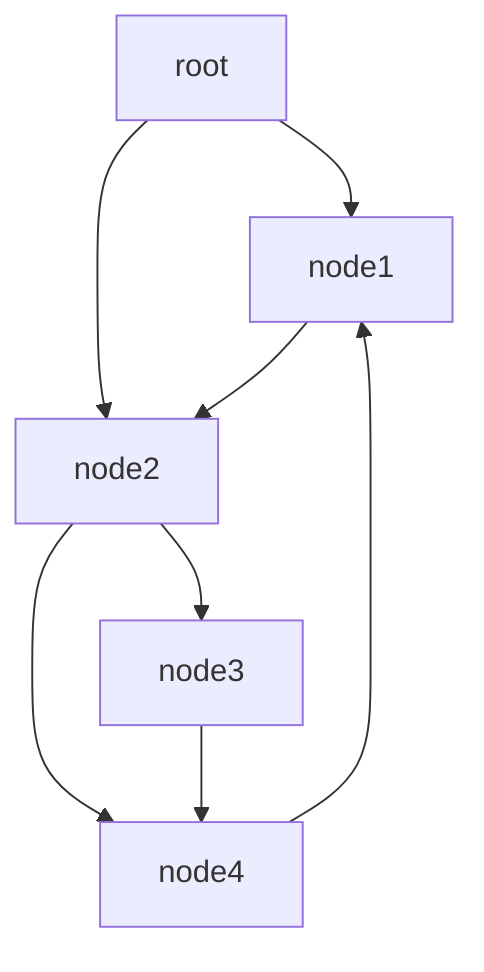

# Документация по разделу dte_token::data (память)
`dte_token::data` - это декларативная область, что содержит необходимые конструкции для манипулирования памятью, содержит:
- `complex_type` - конструктор для создания "класса", хранит информацию о создании и копирования(при наличии) типа, хранит является ли тип областью пространства
- `complex_value` - "класс", который имеет представление о своих данных, способен обеспечивать глубокое копирование
- `scope` - область пространства, что хранит любую информацию, что является наследником `object`
- `scope_path` - путь между областями прострванств
- `smart_pointer` - умный указатель, был спроектирован как более удобная модель `std::shared_ptr`
- `type` - структура, хранящая rtti данные
- `value` - структура, что хранит значение и его тип по type

# Документация по scope и управления областями пространств

