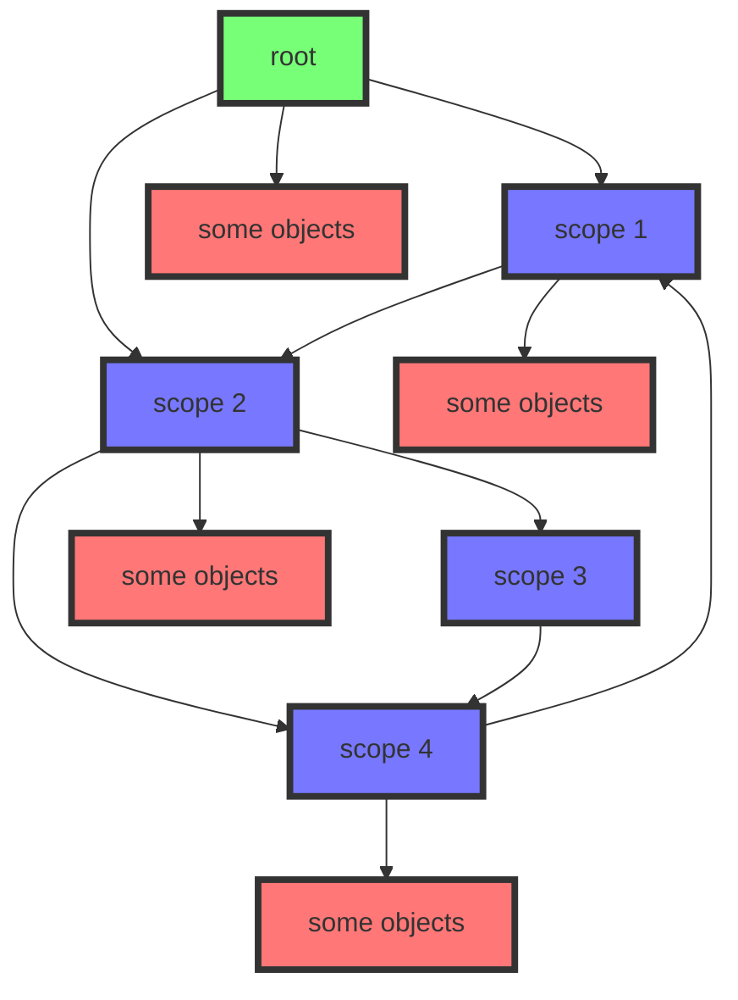

# Документация по разделу dte_token::data (память)
`dte_token::data` - это декларативная область, что содержит необходимые конструкции для манипулирования памятью, содержит:
- `complex_type` - конструктор для создания "класса", хранит информацию о создании и копирования(при наличии) типа, хранит является ли тип областью пространства
- `complex_value` - "класс", который имеет представление о своих данных, способен обеспечивать глубокое копирование
- `scope` - область пространства, что хранит любую информацию, что является наследником `object`
- `scope_path` - путь между областями прострванств
- `smart_pointer` - умный указатель, был спроектирован как более удобная модель `std::shared_ptr`
- `type` - структура, хранящая rtti данные
- `value` - структура, что хранит значение и его тип по type

# Документация по scope и управления областями пространств

Приведена диаграмма отображающая пример взаимодействия scope:

***Текущая система абстракта и подразумевает, что только у root есть владелец.  
Владелец, что представлен потоком, удержживает `smart_pointer<object>` на root.***  
  
Владение - это хранение `smart_pointer<object>`. То есть, если все владельцы объекта прекратят свое сущестование, то зависимый scope будет уничтожен.
Кроме этого, владение можно убрать или добавить.
Стрелки обозначают владение, то есть ***root*** владеет ***scope 1*** и ***scope 2***.
Если уничтожить ***root***, то ничего не произойдет. Система просто лишится рута. Но вот если уничтожить после этого ***scope 4***, то посыпится вся система - ***scope 1*** лишится всех владельцев, это уничтожит ее и приведет к тому, что ***scope 2*** лишится всех владельцев и так далее.
Система позволяет создавать изолированные графы, что является большим недостатком в неумелых руках, ведь если мы захотим высвободить всю нашу память нужно будет найти все кольца и разорвать их. При алгоритмической ошибке или потери важной информации высвобождение ключевых узлов может не случиться и изолированный граф будет висеть до конца программы без высвобождения.  

Получение объекта может быть как по связи владения ***(в сторону стрелки)***, так и по связи зависимости. Из-за того, что зависимость не позволяет передавать `smart_pointer<object>` на владельца `scope`, то приходится использовать массив обычных указателей на владельцев, поэтому для безопасности нельзя получить умный указатель на владельца, если у того нет владельца (который будет хранить этот умный указатель).  
По этой причине мы не можем получить умный указатель на ***root***, но это не запрещает получать другие узлы, что зависят от ***root***.  

Система получения объекта по обратной связи допускает, что владельцы могут иметь одинаковые `ID`, поэтому если первый встречный владелец с указанным `ID` в пути не содержит нужную нам информацию, то поиск продолжится в следущих владельцах, до тех пор, пока не будет получен результат или его отсутсвие.

Результат получения - всегда `smart_pointer<object>`.
